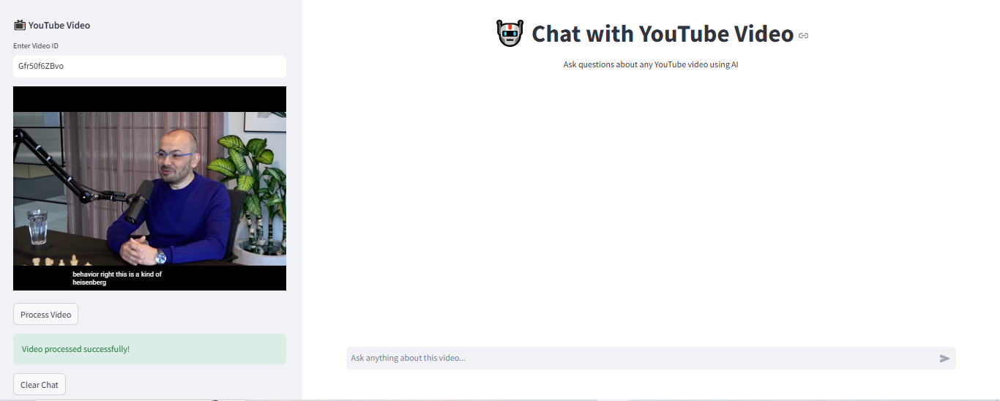
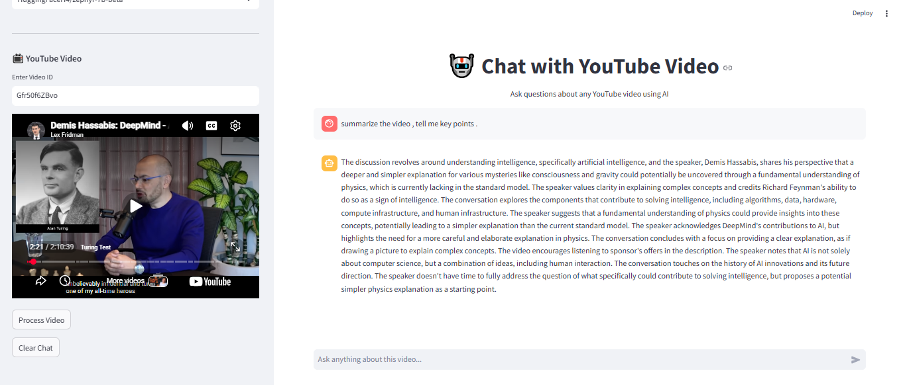
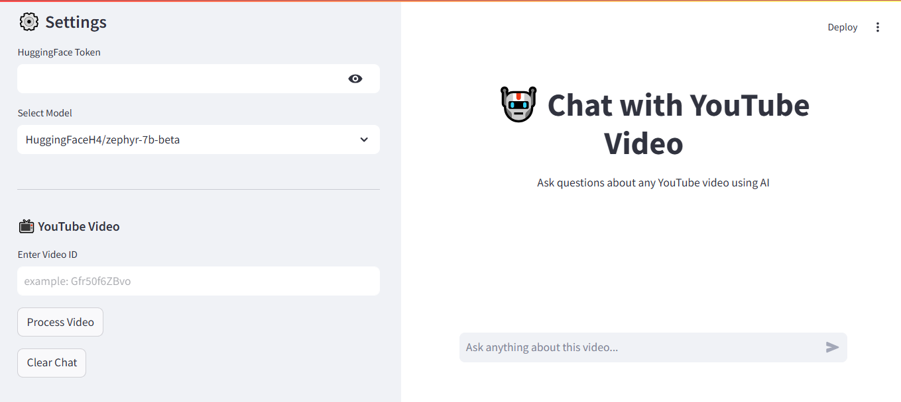

# 🎥 YouTube AI Assistant


## 📑 Table of Contents
- [Description](#-description)
- [Demo](#-demo)
- [Features](#-features)
- [Tech Stack](#-tech-stack)
- [Project Structure](#-project-structure)
- [Architecture](#-architecture-diagram)
- [Installation](#️-installation)
- [Usage](#️-usage)
- [Example Output](#-example-output)
- [Configuration](#-environment-variables)
- [Roadmap](#-roadmap)
- [FAQ](#-faq)
- [Contributing](#-contributing)
- [License](#-license)
- [Author](#-author)

---

## 📌 Description
This project converts any YouTube video into an interactive AI chatbot. By extracting the video's transcript, it builds a Retrieval-Augmented Generation (RAG) pipeline that allows users to ask questions and get accurate answers based strictly on the video's context. 

It leverages LangChain for orchestration, Hugging Face models for embeddings and text generation, and a FAISS vector database for fast, reliable information retrieval.

---

## 📷 Demo
<table align="center">
  <tr>
    <td></td>
    <td></td>
  </tr>
  <tr>
    <td colspan="2" align="center">
      
    </td>
  </tr>
</table>

---

## 🚀 Features
- **YouTube Transcript Extraction:** Automatically fetches closed captions from YouTube videos.
- **Advanced Text Chunking:** Splits long transcripts into manageable overlapping chunks.
- **Local Vector Database:** Converts text into embeddings and stores them efficiently using FAISS.
- **Conversational Memory:** Sleek, ChatGPT-style chat interface built with Streamlit.
- **Flexible LLM Support:** Easily switch between Open-Source models (like Zephyr-7B) or Gated models (like Llama-3.1).

---

## 🛠 Tech Stack
- **Frontend:** Streamlit
- **Framework:** LangChain (`langchain-core`, `langchain-community`)
- **LLM & Embeddings:** Hugging Face Inference API & `sentence-transformers`
- **Vector Store:** FAISS (Facebook AI Similarity Search)
- **Data Extraction:** `youtube-transcript-api`

---

## 📂 Project Structure
```text
youtube-chatbot/
│
├── app.py                  # Main Streamlit application file
├── requirements.txt        # Python dependencies
├── README.md               # Project documentation
└── .gitignore              # Files to ignore in Git
```

---
## 🧠 Architecture Diagram
- **Input** : User provides a YouTube Video ID.

- **Extract** : youtube-transcript-api pulls the text.

- **Process** : LangChain chunks the text.

- **Embed** : Hugging Face creates embeddings.

- **Store** : FAISS indexes the embeddings.

- **Query** : User asks a question via Streamlit.

- **Retrieve** : FAISS finds relevant text chunks.

- **Generate** : LLM (e.g., Llama-3/Zephyr) generates an answer based only on the retrieved context.

---

⚙️ Installation
1. Clone the repository

```Bash
git clone https://github.com/ziaulislam-mughal/Youtube-Chatbot.git

```

2. Go to project folder

```Bash
cd youtube-chatbot
```

3. Install dependencies


```Bash
pip install -r requirements.txt
```
4. Run application

```Bash
streamlit run app.py
```

---
### ▶️ Usage
- Open the app in your browser (usually http://localhost:8501).

- Enter your Hugging Face API Token in the sidebar.

- Enter a YouTube Video ID (e.g., for https://www.youtube.com/watch?v=Gfr50f6ZBvo, the ID is Gfr50f6ZBvo).

- Click "Process Video" and wait for the vector store to build.

- Use the chat interface to ask questions about the video!
---
## 🔑 Environment Variables

You do not need to hardcode your keys. The app securely asks for your API token via the UI. However, to run the app properly, you must have a valid Hugging Face account and an Access Token (Read permissions).

Get your token here: [Hugging Face Settings](https://huggingface.co/settings/tokens)

---

## 🗺 Roadmap

- [ ] Add support for videos without subtitles (using Whisper for audio transcription).
- [ ] Add a "Summarize Video" button.
- [ ] Add timestamped source links so users can click and jump to the exact part of the video.
- [ ] Support multiple languages.

---

## ❓ FAQ

**Q: Why am I getting a 403 Forbidden error with Llama 3.1?** **A:** Llama 3.1 is a gated model. You must visit the [Meta-Llama Hugging Face page](https://huggingface.co/meta-llama/Llama-3.1-8B-Instruct) and agree to their terms to use it. Alternatively, use the Zephyr-7B option in the sidebar.

**Q: Can I deploy this for free?** **A:** Yes! This app is fully compatible with [Streamlit Community Cloud](https://share.streamlit.io/) for free hosting.

---

## 🤝 Contributing

Contributions, issues, and feature requests are welcome!  
Feel free to check the [issues page](https://github.com/Ziaulislam-mughal/youtube-chatbot/issues). If you're making major changes, please open an issue first to discuss what you would like to change.

---

## 🏆 Acknowledgements

* [Streamlit](https://streamlit.io/) for the amazing frontend framework.
* [LangChain](https://www.langchain.com/) for simplifying the RAG pipeline.
* [Hugging Face](https://huggingface.co/) for open-source AI models.

---

## 📄 License

This project is licensed under the MIT License.

---

## 👨‍💻 Author

**Zia Ul Islam** | [GitHub Profile](https://github.com/Ziaulislam-mughal)
